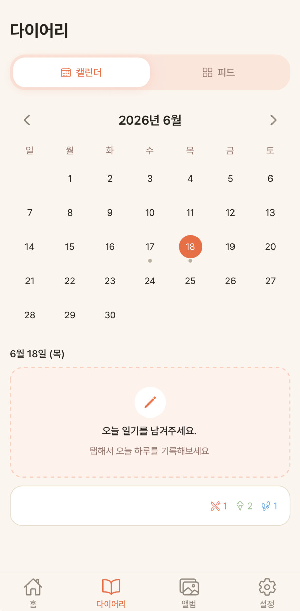
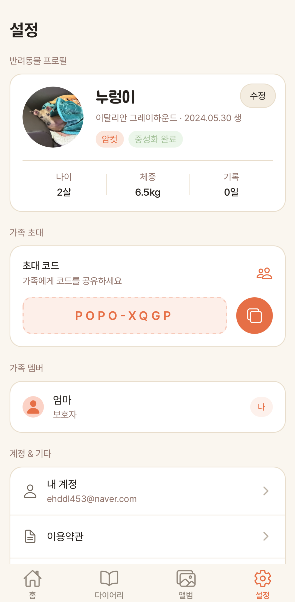
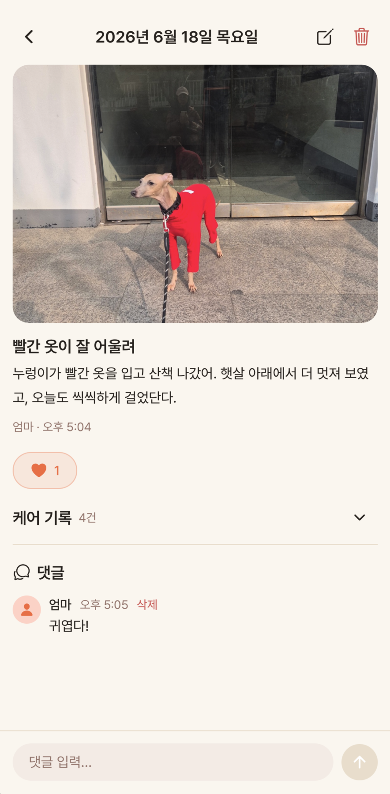
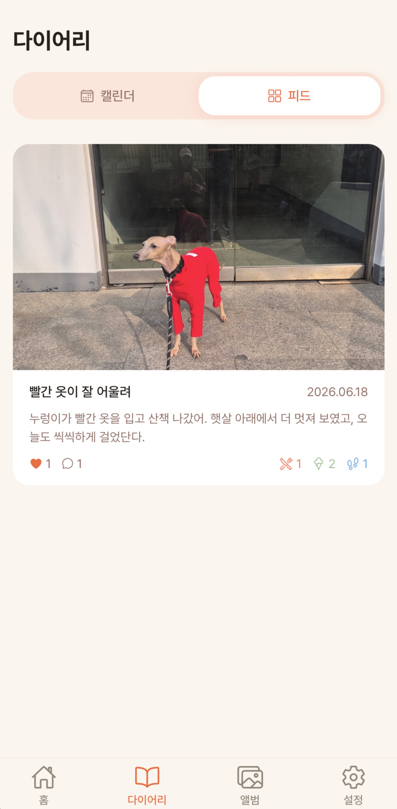

# 🐾 포포노트 (PopoNote)

**가족이 함께 쓰는 반려동물 다이어리**

https://poponote.devwoodie.com

하루 한 장, 우리 아이의 소중한 순간을 기록하세요.
사진을 올리면 AI가 일기를 써주고, 가족 모두가 함께 밥·간식·산책을 챙길 수 있어요.

## 주요 기능

- **AI 일기 작성** — 사진 한 장이면 AI가 따뜻한 일기를 작성해줍니다
- **가족 공유** — 초대 코드 하나로 가족 모두가 함께 기록해요
- **케어 기록** — 밥, 간식, 산책을 누가 언제 챙겼는지 한눈에
- **다이어리** — 캘린더와 피드로 우리 아이의 하루하루를 돌아보세요
- **앨범** — 월별로 정리되는 사진 앨범

## 스크린샷

| 로그인 | 홈 | 다이어리 |
|:---:|:---:|:---:|
|  |  |  |

| 설정 | AI 일기 작성 | 일기 상세 | 피드 |
|:---:|:---:|:---:|:---:|
|  |  |  |  |

## 기술 스택

- **프론트엔드**: React Native + Expo (SDK 56), TypeScript, Expo Router
- **상태 관리**: TanStack Query (React Query)
- **백엔드**: Supabase (Auth, PostgreSQL, Storage, Edge Functions)
- **인증**: 카카오 로그인 + Sign in with Apple
- **AI**: OpenAI GPT-4.1 Mini (사진 분석 → 일기 생성)